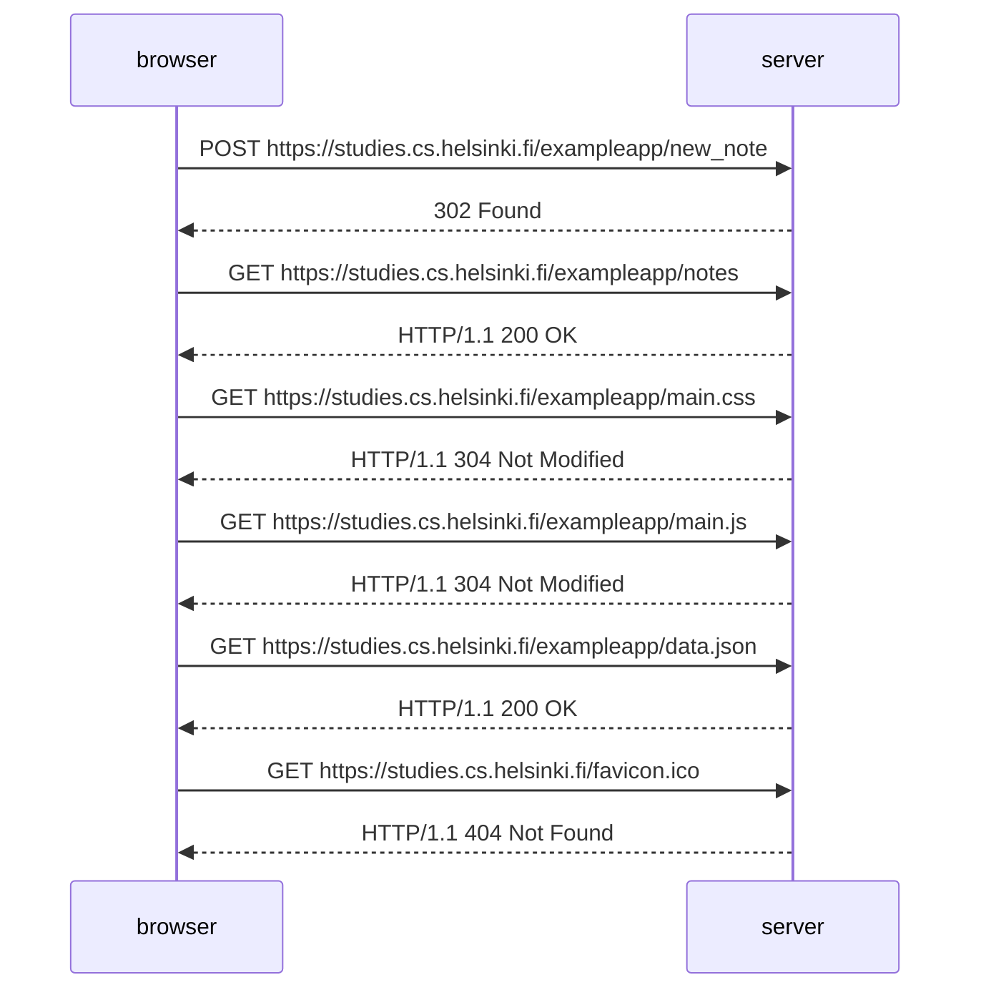
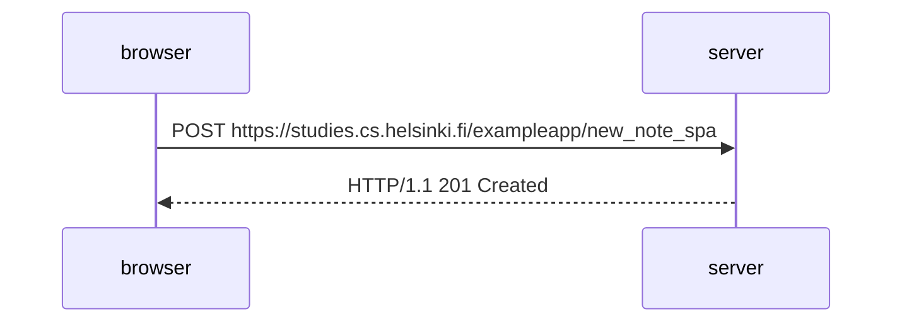

Tehtävä

```mermaid
sequenceDiagram;
  participant browser;
  participant server;

  browser ->>server: POST https://studies.cs.helsinki.fi/exampleapp/new_note

  server -->> browser: 302 Found;
  browser ->> server:GET https://studies.cs.helsinki.fi/exampleapp/notes;
  server -->> browser: HTTP/1.1 200 OK;
  browser ->> server: GET https://studies.cs.helsinki.fi/exampleapp/main.css;
  server -->> browser: HTTP/1.1 304 Not Modified;
  browser ->> server: GET https://studies.cs.helsinki.fi/exampleapp/main.js;
  server -->> browser: HTTP/1.1 304 Not Modified;
  browser ->> server: GET https://studies.cs.helsinki.fi/exampleapp/data.json;
  server -->> browser: HTTP/1.1 200 OK;
  browser ->> server: GET https://studies.cs.helsinki.fi/favicon.ico;
  server -->> browser: HTTP/1.1 404 Not Found;
```

```mermaid
sequenceDiagram;
  participant browser;
  participant server;

  browser ->>server: POST https://studies.cs.helsinki.fi/exampleapp/new_note_spa;
  server -->> browser: HTTP/1.1 201 Created;
```
